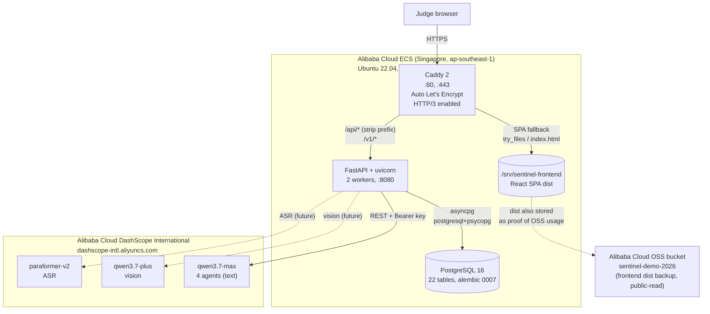
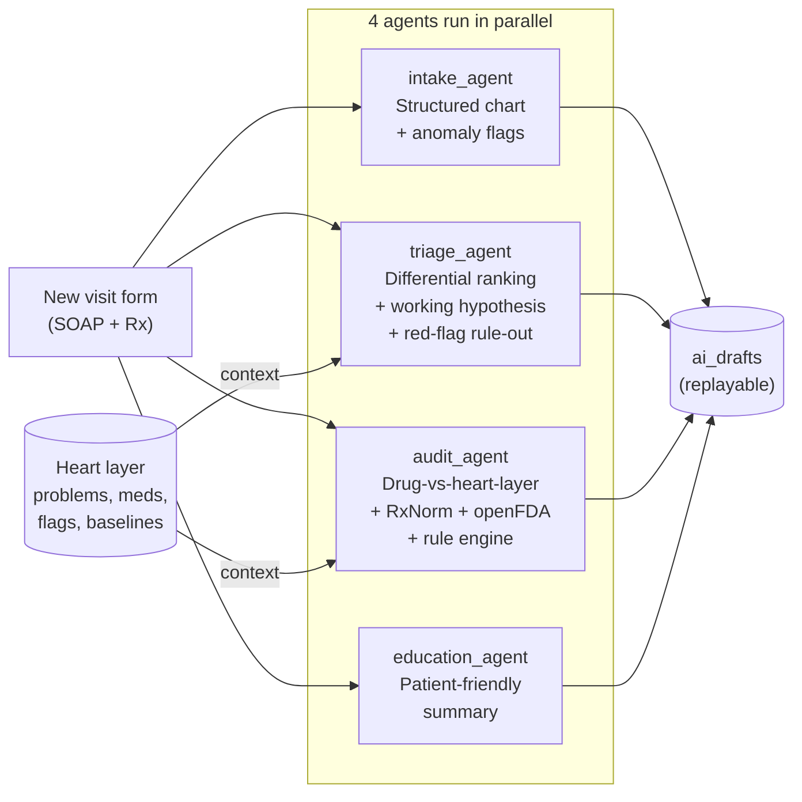
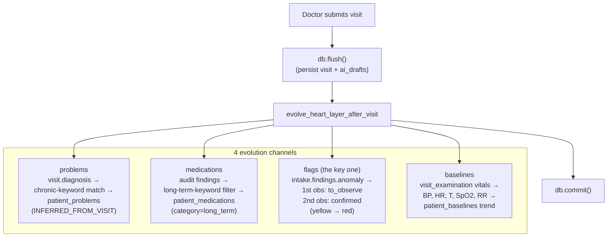
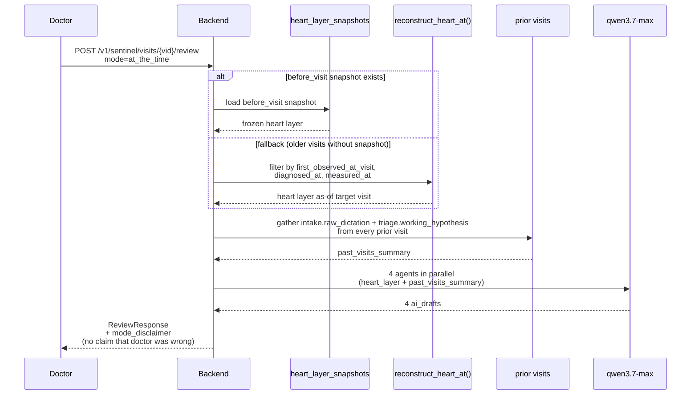
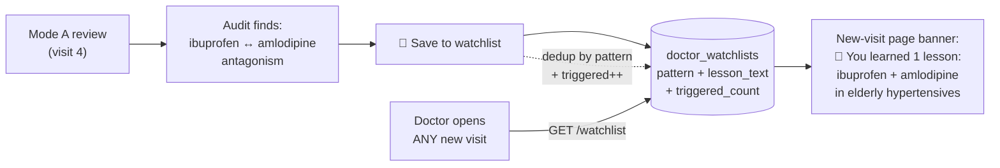
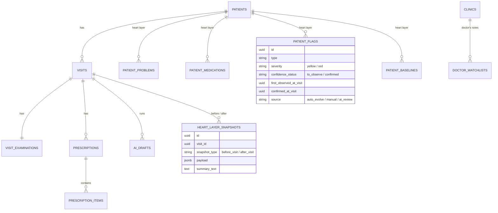
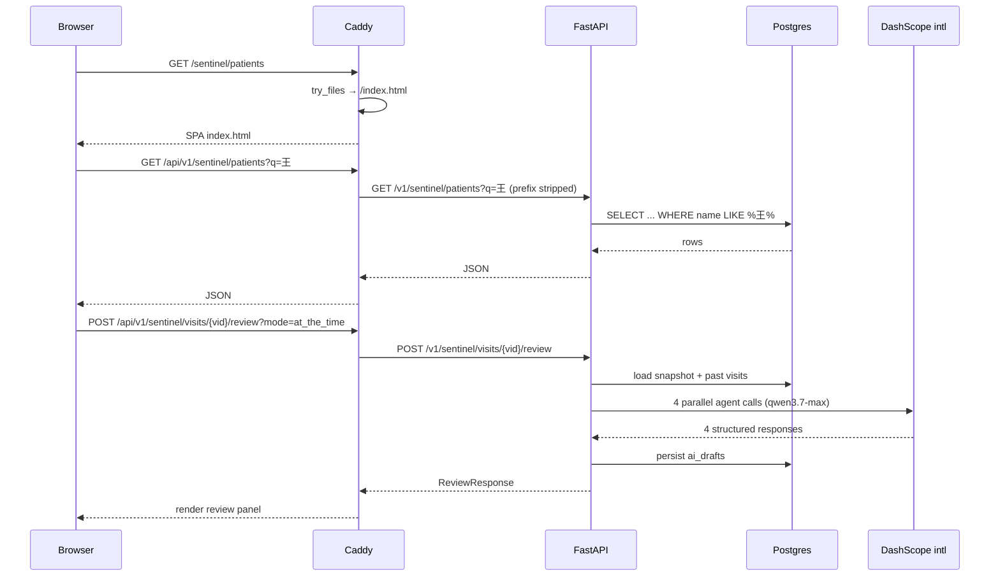

# 🛡️ Sentinel — System Architecture

> Companion to [`README.md`](../README.md) and [`ALIYUN.md`](ALIYUN.md). All diagrams use Mermaid (GitHub renders inline).

---

## 1. Deployment topology

---

## 2. The four sentinel agents

---

## 3. Phase 5 — heart layer auto-evolution (post-visit hook)

Idempotency: re-running the same visit through evolution does not duplicate problems / meds / flags (dedup + first-observed-at-visit guard). Baselines append.

---

## 4. Phase 6 — Mode A retrospective review

The bug we found mid-build: a naive replay shows the AI today's heart layer, not the heart layer as it was at the target visit. That leaks future knowledge into "what the AI would have known" and is hindsight bias.

The fix:

---

## 5. Phase 7 — doctor watchlist (retrospective coaching)

The key design point: the watchlist is the doctor's, not the patient's. A lesson learned on Auntie Wang surfaces the next time the doctor sees anyone with a similar pattern.

---

## 6. Database schema highlights

Full schema: 7 alembic migrations in [`backend/alembic/versions/`](../backend/alembic/versions/).

---

## 7. Request flow — happy path

---

## 8. Why Caddy serves the SPA (not OSS)

We initially planned **OSS Standard bucket as the public frontend host**, with Caddy as backend-only reverse proxy. We hit a known limitation: Alibaba Cloud OSS bucket-domain endpoints add `Content-Disposition: attachment` to HTML responses as an **anti-phishing measure** — the browser downloads `index.html` instead of rendering it. (curl does not parse `Content-Disposition`, so this was not caught in API tests.)

Two workarounds exist:
1. **Custom domain with CNAME + own SSL certificate** — feasible but requires extra DNS work and an SSL cert per domain.
2. **OSS website-hosting endpoint** (`<bucket>.oss-website-<region>.aliyuncs.com`) — HTTP only, would force mixed-content issues with HTTPS backend calls.

We chose a third path: **let Caddy on ECS serve the SPA directly** (`try_files {path} /index.html`). Single origin, single TLS cert, no CORS overhead. The OSS bucket still holds the same `dist/` (uploaded with the `oss2` SDK — see [`ALIYUN.md`](ALIYUN.md)) as proof of OSS usage per the hackathon rules, and remains available as a backup CDN-style origin.

---

## 9. What's outside the diagram (deferred / future)

- **Phase 2.5 — backfill heart-layer snapshots** for the 169 mock visits (currently Mode A falls back to `reconstruct_heart_at` for those; Auntie Wang has real snapshots).
- **Vision / ASR** (qwen3.7-plus / paraformer-v2 wired but UI integration parked post-hackathon).
- **Multi-tenant auth** (currently `SENTINEL_DEV_BYPASS_AUTH=true` for judge access; Firebase wiring exists but is dormant).
- **CI/CD** (38 commits in 3 days are the iteration log; future migration to GitHub Actions).
